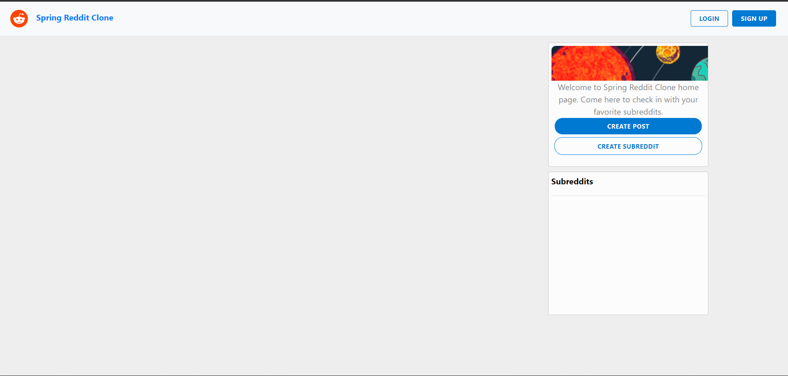
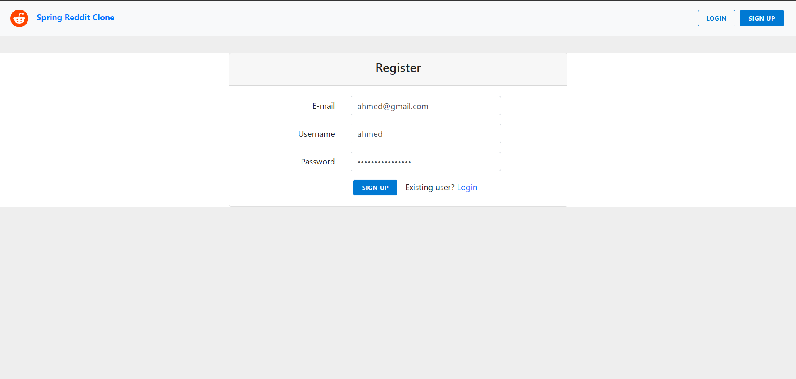
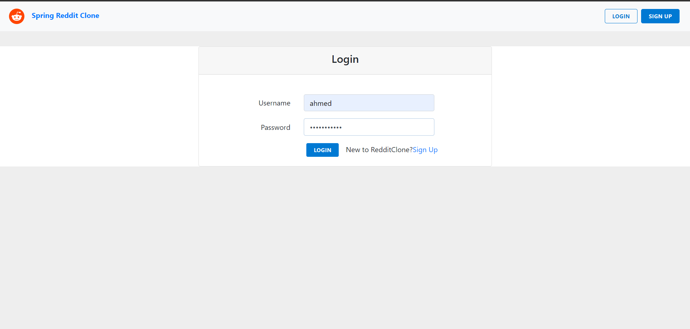
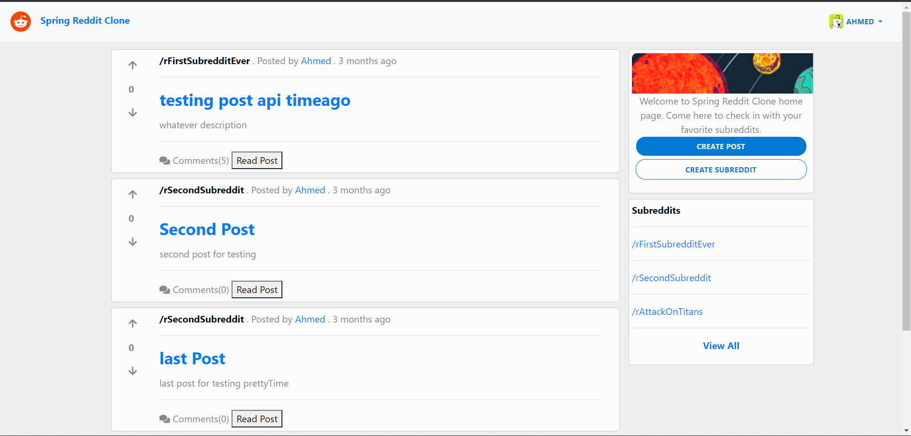
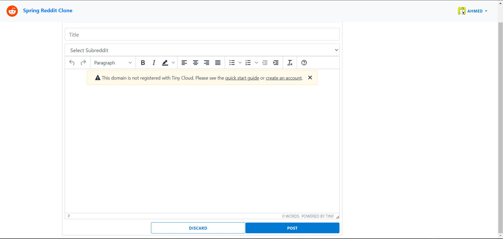
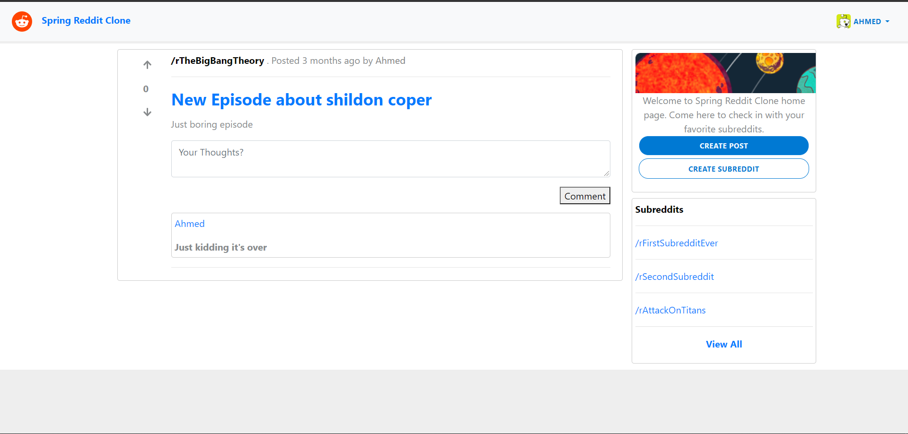

Reddit Clone REST API
==================
Reddit Clone REST API created with SpringMVC, SpringDataJpa, Hibernate, SpringSecurity, JWT, and MySQL.
Check Angular frontend [here](https://github.com/ahmd-nabil/angular-reddit-clone)

## Table of Contents
____________________
* [Technologies](#technologies)
* [Getting Started](#getting-started)
* [Screenshots](#screenshots)

## Technologies
* spring-boot-data-jpa: 2.4.4
* spring-boot-starter-mail: 2.4.4
* spring-boot-starter-security: 2.4.4
* spring-boot-starter-web: 2.4.4
* mysql-connector-java: 8.0.23
* lombok: 1.18.18
* io.jsonwebtoken:jjwt-api: 0.11.2
* io.jsonwebtoken:jjwt-impl: 0.11.2
* prettytime: 5.0.0.Final
* springfox-boot-starter: 3.0.0

# Getting Started
* ## To run Spring-Boot Reddit API:
1. Navigate to the root of the project
2. Run maven wrapper to create the jar file
   
    ``` mvnw clean package ```

3. Run the Jar file
   
    ```java -jar target\reddit-clone-0.0.1-SNAPSHOT.jar```

You can check the API documentation using swagger
http://localhost:8080/swagger-ui/#/

* ## Check Angular frontend and how to run it [here](https://github.com/ahmd-nabil/angular-reddit-clone)

# Screenshots
Main Page:



Registration Page:



Login Page:



Main Page (authenticated user):



Create Post:



Post Page:


